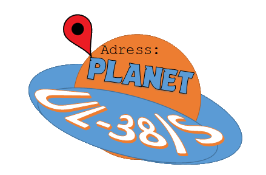

# Address: Planet UL-38/S

After a crash landing on a mysterious red planet, Fred and Gertrude are stuck in a dangerous environment with hostile aliens. As Fred, you must fight the enemies, find food and collectables, and find a way to escape this planet. 

This game was made in Unity 5.4.0f3 in 2017-2018 as part of a high school assignment. Don't expect it to be of high quality. Currently (as of April 2024), the Unity 5.4.0f3 editor crashes after logging in. Maybe someday I will revisit this project and upgrade it to work with newer versions of Unity. 
